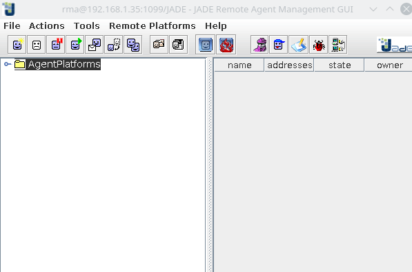

# Systemes Multi-agents -Simulation de marché

Ce projet a pour objectif de fournir une simulation de marché financier par le biais du développement des acteurs qu'elle contient.

## Utilisation
Pour lancer le programme, exécuter la commande suivante dans le dossier du projet après avoir ajouté Jade à votre `CLASSPATH`:

```
java -jar jade.Boot -agents sim:com.sevenmoor.Simulation"(30 5.0 120 banane pomme figue)"
```

On pourra bien sûr faire varier les paramètres selon les règles suivantes:
- Le premier paramètre est le nombre d'agents à créer
- Le second est l'argent de départ pour chaque agent
- Le troisième est la durée de la simulation
- Tous les arguments suivants sont les noms des produits que s'échangeront les agents

Alternativement, on pourra créer l'agent simulation avec ces paramètres dans la gui, si on souhaite lancer le sniffer par exemple.

